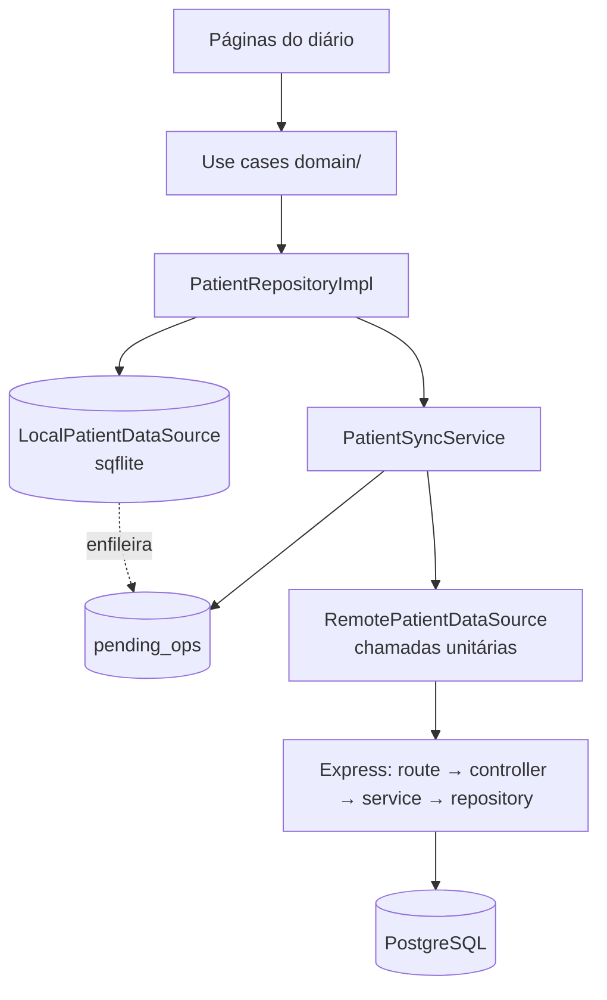

# Fases 3–5 do plano arquitetural — Design

**Spec**: `.specs/features/arch-phases-3-5/spec.md`
**Status**: Draft

Decisões de projeto conferidas antes de desenhar (`.specs/STATE.md`): **AD-002** (erro de API carrega `code` no corpo) — os 400 de paginação seguem o contrato; **AD-003** (`requireRole` resolve papel por requisição) — as rotas novas continuam sob `verifyJwt` + `requireRole('PATIENT')` do router; **AD-004** (auditoria best-effort) — os handlers novos chamam `recordAudit` como os existentes. Nenhuma decisão ativa precisa ser superada.

---

## Architecture Overview

Três mudanças estruturais, uma por camada, mais duas de superfície:

1. **Identidade** — a entrada de diário passa a ter `id` UUID próprio, do modelo Dart até a linha do SQLite.
2. **Op-log** — a escrita local deixa de ser "regrava a coleção e marca pendente" e passa a "grava a linha e enfileira a operação"; o sync drena a fila em ordem contra a API unitária.
3. **Camadas no backend** — carbs, insulin e alerts saem do handler-monolito para rota → controller → service → repository, o que também é o que torna a rota testável sem Postgres.
4. **`domain/` no patient** e **tema claro/escuro**, ambos sem efeito no fluxo de dados.



O caminho de leitura de glicose não muda: `SensorCubit → PatientCubit → saveReadings` continua no fluxo de coleção com debounce.

---

## Code Reuse Analysis

### Componentes existentes a aproveitar

| Componente | Local | Como usar |
| ---------- | ----- | --------- |
| Endpoints unitários de carbs e insulin | `backend/src/routes/carbs.ts:55-160`, `insulin.ts:66-200` | Já existem, com validação de UUID, `updateMany`/`deleteMany` escopados por `patientId` e `recordAudit`. Servem de molde para os de alerts e são movidos para as camadas novas sem mudar contrato |
| `asyncHandler`, `verifyJwt`, `requireRole`, `ensurePatient`, `recordAudit`, `prismaError` | `backend/src/middleware/`, `backend/src/lib/` | Reaproveitados na íntegra pelas camadas novas; nenhum middleware é reescrito |
| Runner `node:test` + `tsResolve.mjs` | `backend/tests/` | A suíte nova entra no mesmo runner (`npm test`), sem trazer jest |
| Harness sqflite em memória | `test/features/patient/local_patient_datasource_test.dart:5-17` | `sqflite_common_ffi` + `inMemoryDatabasePath` já em uso; os testes de migração e de op-log usam o mesmo setup |
| `_FakeRemote` do teste de sync | `test/features/patient/patient_sync_service_test.dart:9` | Estendido com os métodos unitários; evita reinventar dublê |
| `PatientSyncService` (debounce, retry, reconexão, guarda de dono P19) | `lib/features/patient/data/sync/patient_sync_service.dart` | O esqueleto fica; só `_pushPending` troca de estratégia |
| `replaceWithServerSnapshot` | `patient_local_datasource.dart:246` | Mantido; o critério de "linha pendente" muda de `synced = 0` para "id citado em `pending_ops`" nas três coleções migradas |
| Padrão `domain/` do auth | `lib/features/auth/domain/{entities,repositories,usecases}` | Copiado como forma para o patient |
| `AppTheme.light()` | `lib/core/theme/app_theme.dart:59` | Vira a instância clara da paleta; a estrutura de `ThemeData` é reaproveitada por `AppTheme.dark()` |
| Persistência de `onboarding_done` | `lib/app.dart:74-86` | Mesmo mecanismo (`SharedPreferences`) para `theme_mode` |

### Pontos de integração

| Sistema | Integração |
| ------- | ---------- |
| API de carbs/insulin | O app passa a chamar `PUT /…/item/:id` com fallback para `POST /…/item` no 404 |
| API de alerts | Ganha os três verbos unitários e passa a devolver `id` no `GET` |
| SQLite local | Sobe para a versão 3: coluna `id`, troca de PK em `carbs`/`insulin`/`alerts`, tabela `pending_ops` |
| Prisma | Sem modelo novo; só anotação de roadmap e, se faltar, índice de paginação |

---

## Components

### `PendingOp` + tabela `pending_ops`

- **Purpose**: registrar, em ordem, cada mutação de diário que ainda não foi confirmada pelo backend.
- **Location**: `lib/features/patient/data/datasources/patient_local_datasource.dart` (tabela) e `lib/features/patient/data/sync/pending_op.dart` (modelo).
- **Interfaces**:
  - `enqueueOp(PendingOp op)` — chamado dentro da mesma transação da escrita da linha
  - `pendingOps({int limit})` → `List<PendingOp>` em ordem crescente de `seq`
  - `deleteOp(int seq)`
  - `pendingEntityIds(String entity)` → `Set<String>` (usado pela reconciliação para não sobrescrever pendência)
- **Dependencies**: sqflite.
- **Reuses**: transação e `batch` já usados em `_replaceTable`.

### `LocalPatientDataSource` (escritas unitárias)

- **Purpose**: gravar uma linha e sua operação pendente atomicamente.
- **Location**: `lib/features/patient/data/datasources/patient_local_datasource.dart`.
- **Interfaces**:
  - `upsertCarb(CarbEntry)`, `deleteCarb(String id)`
  - `upsertInsulin(InsulinEntry)`, `deleteInsulin(String id)`
  - `upsertAlert(AppAlertItem)`
  - `save*` de coleção seguem existindo para readings, settings e para o bootstrap de conta
- **Dependencies**: `pending_ops`.
- **Reuses**: mappers de linha já existentes, acrescidos da coluna `id`.

### `RemotePatientDataSource` (chamadas unitárias)

- **Purpose**: falar a API por item.
- **Location**: `lib/features/patient/data/datasources/patient_remote_datasource.dart`.
- **Interfaces**:
  - `upsertCarb(CarbEntry)` — `PUT /carbs/item/:id`; em 404, `POST /carbs/item`
  - `deleteCarb(String id)` — `DELETE /carbs/item/:id`; 404 tratado como sucesso
  - equivalentes para insulin e alerts
- **Dependencies**: Dio.
- **Reuses**: mappers `_carbToRow`/`_insulinToRow`/`_alertToRow` existentes.

### `PatientSyncService._drainOps`

- **Purpose**: drenar a fila em ordem, parando no primeiro erro recuperável.
- **Location**: `lib/features/patient/data/sync/patient_sync_service.dart`.
- **Interfaces**: substitui o trecho de carbs/insulin/alerts dentro de `_pushPending`; readings e settings continuam pelo caminho de coleção.
- **Dependencies**: `LocalPatientDataSource`, `RemotePatientDataSource`, `AuthTokenStore` (guarda de dono, P19).
- **Reuses**: `_pushWithRetry`, debounce, listener de conectividade — nada disso muda.

### Camadas do backend

- **Purpose**: separar transporte, orquestração e acesso a dados nas três rotas do diário.
- **Location**: `backend/src/repositories/{carb,insulin,alert}Repository.ts`, `backend/src/services/{carb,insulin,alert}Service.ts`, `backend/src/controllers/{carb,insulin,alert}Controller.ts`; as rotas viram fiação.
- **Interfaces** (mesmo formato nas três):
  - repository: `findPage({ patientId, before?, limit })`, `create(data)`, `update(id, patientId, data)` → `boolean`, `remove(id, patientId)` → `boolean`
  - service: valida entrada, chama repository, dispara `recordAudit`
  - controller: traduz HTTP ↔ service (status, corpo, `{ error, code }`)
- **Dependencies**: client Prisma **injetado** no repository (é o que permite o fake nos testes).
- **Reuses**: validadores e mensagens de erro já escritos nas rotas atuais.

### `domain/` do patient

- **Purpose**: tirar entidade e regra de dentro de `presentation/`.
- **Location**: `lib/features/patient/domain/{entities,repositories,usecases}/`.
- **Interfaces**: `PatientRepository` (abstrata) em `domain/repositories/`; `PatientRepositoryImpl` em `data/repositories/`; casos de uso `LoadPatientData`, `RefreshPatientData`, `AddCarbEntry`, `EditCarbEntry`, `DeleteCarbEntry`, `AddInsulinEntry`, `EditInsulinEntry`, `DeleteInsulinEntry`, `SaveGlucoseReadings`, `SaveAlerts`, `UpdateAlertSettings`, `ClearReadings`, `EnsurePatientOwner`.
- **Dependencies**: injeção via `injection_container.dart`.
- **Reuses**: forma exata do `lib/features/auth/domain/`.

### Tema

- **Purpose**: claro/escuro com preferência persistida.
- **Location**: `lib/core/theme/glucore_colors.dart` (`ThemeExtension`), `lib/core/theme/app_theme.dart` (`light()`/`dark()`), `lib/core/theme/theme_preference_store.dart`, `lib/core/theme/theme_cubit.dart`.
- **Interfaces**: `ThemeCubit.setMode(ThemeMode)`, `ThemeCubit.state` (ThemeMode); `context.glucoreColors` como extension de conveniência.
- **Dependencies**: `SharedPreferences`, `flutter_bloc`.
- **Reuses**: `ThemeData` já montado em `AppTheme.light()`.

---

## Data Models

### Entrada de diário (Dart)

```dart
class CarbEntry {
  const CarbEntry({required this.id, required this.grams,
                   required this.description, required this.time});
  factory CarbEntry.create({...}) // gera id UUID v4
  final String id;
  final int grams;
  final String description;
  final DateTime time;
}
```

`InsulinEntry` e `AppAlertItem` ganham o mesmo campo `id`. `GlucoseReadingItem` **não** ganha (append-only, decisão registrada na spec).

### SQLite local — versão 3

```sql
CREATE TABLE carbs(
  id TEXT PRIMARY KEY,
  time_ms INTEGER NOT NULL,
  grams INTEGER NOT NULL,
  description TEXT NOT NULL,
  synced INTEGER NOT NULL DEFAULT 0
);
CREATE INDEX idx_carbs_time ON carbs(time_ms);

CREATE TABLE pending_ops(
  seq INTEGER PRIMARY KEY AUTOINCREMENT,
  entity TEXT NOT NULL,          -- carbs | insulin | alerts
  entity_id TEXT NOT NULL,
  op TEXT NOT NULL,              -- upsert | delete
  payload_json TEXT,             -- null em delete
  created_at INTEGER NOT NULL
);
```

`insulin` e `alerts` seguem o mesmo desenho (`id TEXT PRIMARY KEY`, `time_ms`/`timestamp_ms` indexado). `readings` e `settings` ficam como estão.

**Migração v2 → v3** (aditiva, sem DROP de dados do paciente): para cada uma das três tabelas — criar `<tabela>_new` com o schema novo, ler as linhas antigas, gerar UUID v4 em Dart por linha, inserir em lote, `DROP TABLE <tabela>` antiga, `ALTER TABLE <tabela>_new RENAME TO <tabela>`, criar o índice, tudo dentro de uma transação. Falha no meio → transação desfeita, banco segue na v2.

### Prisma

Sem modelo novo. `CarbEvent`/`InsulinEvent` já têm `@@index([patientId, eventAt])` e `AlertEvent` tem `@@index([patientId, triggeredAt])` — a paginação está coberta; a tarefa é verificar e registrar, criando migration só se algo faltar. Tabelas sem rota recebem `/// roadmap`.

### Contrato HTTP acrescentado

```
POST   /alerts/item        { id, type, timestampMs }   → 201 { id }
PUT    /alerts/item/:id    { type, timestampMs }       → 204 | 404
DELETE /alerts/item/:id                                 → 204 | 404
GET    /alerts                                          → agora inclui id
GET    /carbs|/insulin|/alerts?before=<ms>&limit=<n>    → página desc
```

---

## Error Handling Strategy

| Cenário | Tratamento | Impacto para o usuário |
| ------- | ---------- | ---------------------- |
| Backend fora do ar durante a drenagem | A op fica na fila; retry com o backoff atual; reagenda na volta da conectividade | Nenhum: o diário local já está gravado |
| 404 em `DELETE …/item/:id` | Tratado como sucesso; a op sai da fila | Nenhum |
| 404 em `PUT …/item/:id` | Cai para `POST …/item` com o mesmo id | Nenhum |
| 401 na drenagem | Interrompe o push e preserva a fila intacta | Nenhum agora; P20 (recuperação de sessão) segue fora de escopo |
| Op com entidade desconhecida ou `payload_json` ilegível | Descartada, log com entidade, id e motivo; a fila continua | Nenhum |
| `limit`/`before` inválidos | 400 com `{ error, code }` (AD-002) | Erro de requisição, sem efeito em dado |
| Migração v2 → v3 falha | Transação desfeita; banco permanece na v2 | Diário intacto; app segue no formato antigo |
| Entrada remota sem `id` válido | Recebe UUID gerado localmente ao ser persistida | Nenhum |

---

## Risks & Concerns

| Concern | Local | Impacto | Mitigação |
| ------- | ----- | ------- | ---------- |
| Truncamento em 100 itens no cliente | `patient_repository.dart:34-36` (`maxEntries`) e `saveCarbs`/`saveInsulin` | Diário maior que 100 entradas é cortado na gravação local — perda de dado independente do backend | Some junto com o replace-all: as escritas unitárias não truncam. Vira critério de aceite de tarefa na fase do op-log |
| `synced` deixa de significar a mesma coisa em todas as tabelas | `patient_local_datasource.dart` | Confusão futura: readings/settings usam a flag, as três coleções do diário usam a fila | Documentar na dartdoc da classe e em `docs/reference/data-models.md`; `replaceWithServerSnapshot` passa a consultar `pendingEntityIds` para as três |
| Alertas duplicam identidade | `patient_cubit.dart:265` (`_prependAlert`) e PK `(type, timestamp_ms)` | Dois alertas do mesmo tipo no mesmo ms colidiam; com `id` deixam de colidir, mas o dedupe por tipo+tempo do cubit precisa continuar valendo | Manter a regra de dedupe no cubit explicitamente testada ao trocar a PK |
| `_handleSensorState` é assíncrono e não serializado (P26) | `patient_cubit.dart:125` | O op-log herda a corrida existente entre eventos de sensor | Fora do escopo (P26 segue aberto); o op-log não agrava, porque cada escrita é transacional e ordenada por `seq` |
| 167 referências estáticas de cor em 22 arquivos | `lib/**` | Migração ampla; risco de tela esquecida no tema escuro | Fatiar por diretório, com um teste de widget que renderiza as telas principais em `ThemeMode.dark` e falha se a superfície resolvida for a clara |
| Testes de rota com Prisma falso podem divergir do Prisma real | `backend/tests/` | Verde falso se o fake for permissivo demais | O fake implementa só a interface do repository (não o client Prisma inteiro), e o contrato de `update`/`remove` retorna booleano — a semântica de "não é meu, então 404" fica no service, coberta por teste |
| Batch deprecated continua vivo | `carbs.ts:165`, `insulin.ts`, `alerts.ts:65` | Cliente antigo ainda apaga a coleção inteira | Aceito por uma release (caminho de rollback do plano); registrado no `backend/README.md` |

---

## Tech Decisions

| Decisão | Escolha | Racional |
| ------- | ------- | -------- |
| Forma da operação pendente | `upsert` com fallback (`PUT` → 404 → `POST`) em vez de `create`/`update` separados | Torna o reenvio idempotente sem o app precisar saber se o servidor já viu a entrada — resolve SYNC-06 sem estado extra |
| Ordem da drenagem | Parar no primeiro erro recuperável, preservando o resto da fila | Ops posteriores podem depender da anterior (criar e depois editar a mesma entrada); enviar fora de ordem produziria estado errado |
| Chave da fila | `seq INTEGER PRIMARY KEY AUTOINCREMENT` | Ordem total barata e estável, imune a relógio do dispositivo |
| Onde o UUID nasce | No app, no construtor de criação | O backend já preserva ids de cliente; gerar no servidor exigiria round-trip antes de a entrada existir offline |
| Escopo da injeção do Prisma | Só no repository das três entidades novas | Menor superfície que torna a rota testável sem Postgres, sem reabrir auth/readings/settings |
| Onde vive a preferência de tema | `SharedPreferences` | Já é o mecanismo de preferência de UI do app (`onboarding_done`); dado não sensível |
| Compatibilidade de entidades no `presentation/` | Barrel `domain/entities/patient_entities.dart` e atualização dos imports | Um re-export mantendo o arquivo antigo seria a mesma mentira de nome que o P5 está corrigindo |

> Candidata a decisão de projeto (`AD-009`), a registrar no `STATE.md` durante a execução: **mutação de diário viaja como operação unitária idempotente num op-log local; replace-all fica restrito a coleções append-only**.
