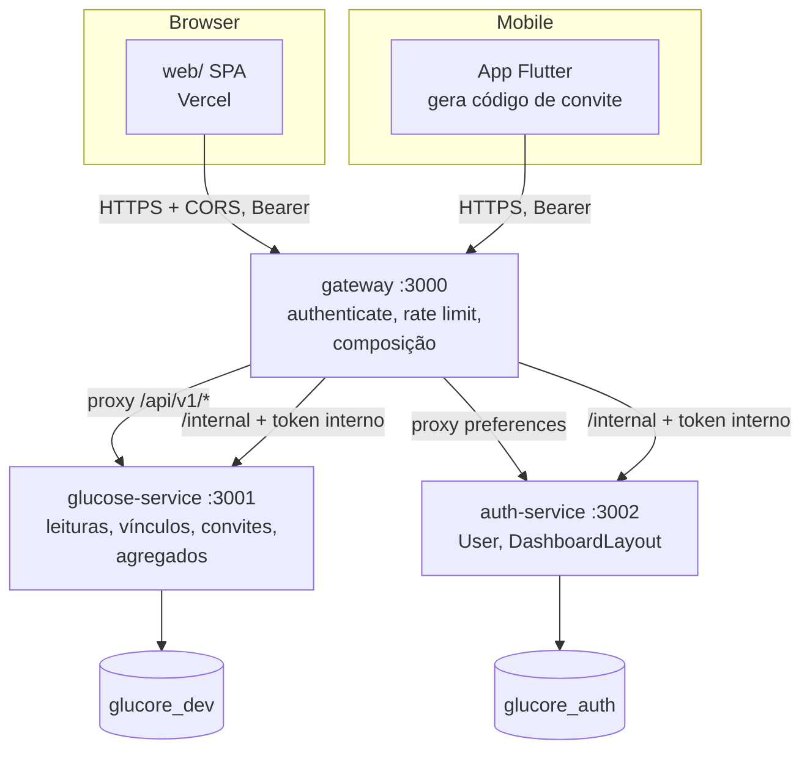
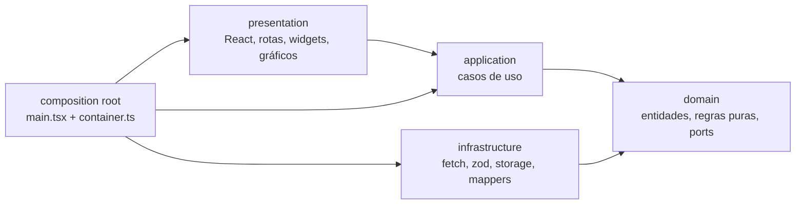

# Dashboard Web Glucore — Design

**Spec**: `.specs/features/web-dashboard/spec.md`
**Status**: Approved

---

## Architecture Overview

Uma SPA em `web/` (Vite + React + TypeScript) fala só com o gateway, direto do navegador e com CORS. O backend continua em três serviços. Cada dado novo mora no serviço que já é dono daquele domínio, e o gateway compõe o que cruza os dois bancos (nomes, visão do admin), como já faz no `/me`.



### Estrutura do frontend (critério 37)

Abordagem escolhida: **feature-first, cada feature com as quatro camadas**. A regra de dependência é verificada por `dependency-cruiser` no CI. As alternativas descartadas estão na tabela abaixo.



| Abordagem | Prós | Contras | Decisão |
| --------- | ---- | ------- | ------- |
| **Feature-first com 4 camadas por feature** | Cada feature é coesa e removível; a regra de camada vale dentro e entre features; reflete o `patient/domain` do app Flutter | Mais pastas | **Escolhida** |
| Camada-first global (`src/domain`, `src/application`...) | Camadas visíveis de cara | Features espalhadas; todo PR toca 4 pastas; acopla features por vizinhança | Descartada |
| Feature-Sliced Design completo | Padrão conhecido | Vocabulário extra (entities, widgets, pages) que dilui as 4 camadas pedidas na rubrica | Descartada |

Regras de dependência (todas viram regra no `.dependency-cruiser.cjs`):

| De | Pode importar | Não pode importar |
| -- | ------------- | ----------------- |
| `domain` | `domain` da mesma feature e `shared/domain` | qualquer outra camada; **qualquer pacote npm** |
| `application` | `domain` e `shared/domain` | `infrastructure`, `presentation`, `react`, `zod`, `recharts` |
| `infrastructure` | `domain`, `shared/domain`, `shared/infrastructure`, `zod` | `application`, `presentation`, `react`, `recharts` |
| `presentation` | `application`, `domain`, `shared/*`, `react` e libs de UI | `infrastructure` |
| `composition/`, `main.tsx` | todas | (único ponto que liga as camadas) |
| Entre features | só o `index.ts` público da outra feature | arquivo interno de outra feature |
| `recharts` | só `shared/presentation/charts/**` | qualquer outro lugar (ARQ-11) |
| `@dnd-kit/*` | só `features/dashboard-layout/presentation/**` | qualquer outro lugar |
| Ciclos | nenhum | qualquer ciclo |

### Decisões do usuário que fecham este design

| Pergunta | Decisão |
| -------- | ------- |
| Biblioteca de gráficos | Recharts 3, atrás de adaptadores, com heatmap em SVG próprio |
| Onde ficam os endpoints | Por domínio, com composição no gateway |
| Consentimento | Código gerado no app móvel, resgatado pelo profissional na web |
| Layout | Salvo no servidor, por usuário |
| Contas | Profissional se cadastra sozinho; admin inicial por seed |

---

## Code Reuse Analysis

### Existing Components to Leverage

| Component | Location | How to Use |
| --------- | -------- | ---------- |
| Módulo `dashboard` (SQL de totais, `groupBy`, `glucose_metrics()`, buckets, excursões) | `backend/services/glucose-service/src/modules/dashboard/` | Estender com `tz`, zonas, AGP, heatmap e carbo/insulina por dia. O serviço passa a receber `patientId` para servir o paciente e o profissional |
| `requireRole`, `createVerifyJwt`, `createRequireInternalAuth` | `backend/packages/shared/src/auth/` | Proteger as rotas novas; acrescentar `requireInternalRole` ao lado de `requireInternalAuth` |
| `AppError`, `BadRequestError`, `ForbiddenError`, `ConflictError`, `asyncHandler`, `parsePageQuery` | `backend/packages/shared/src/` | Erros com `code`, paginação da lista de pacientes e de contas |
| `recordAudit`, `auditRequestContext` | `backend/packages/shared/src/audit/audit.ts` | Auditar convite, vínculo, leitura do profissional, lista de contas |
| Padrão de módulo em camadas (`routes·controller·service·repository·schema·mapper`) | `backend/services/glucose-service/src/modules/settings/` | Molde dos módulos `sharing`, `professional`, `preferences`, `admin` |
| Composition root à mão | `glucose-service/src/container.ts`, `auth-service/src/container.ts`, `gateway/src/container.ts` | Registrar os módulos novos no mesmo estilo |
| Saga com compensação | `gateway/src/modules/register/register.saga.ts` | Molde do `RegisterProfessionalSaga` |
| API Composition com perna degradável | `gateway/src/modules/me/me.controller.ts` | Molde da composição de nomes (`X-Degraded`) |
| `InternalHttpClient`, `AuthClient`, `GlucoseClient` | `gateway/src/clients/` | Novos métodos para lookup de nomes, profissional e estatísticas do admin |
| `createProxyRoute(prefix, service, registry)` | `gateway/src/routes/routingTable.ts` | Novos prefixos `sharing`, `professional` (glucose) e `preferences` (auth) |
| `strictAuthLimiter`/`registerLimiter` | `gateway/src/middleware/rateLimiters.ts` | Molde do limitador de resgate, com chave por usuário |
| Fixtures `signedInPatient`, `db.ts` (truncate dinâmico) | `glucose-service/tests/helpers/` | Testes de integração dos módulos novos |
| `passwordPolicy.ts` e a tabela de casos (AD-001) | `auth-service/src/lib/passwordPolicy.ts` | A web ganha a terceira cópia, acoplada pela mesma tabela de casos |
| Camadas `domain/data/presentation` do `patient` e `domain_layering_test.dart` | `lib/features/patient/`, `test/features/patient/` | Molde da feature `sharing` no app e do teste estrutural de camadas |
| `GlucoreMessenger`, `AppLocalizations`, `ApiClient` | `lib/` | Mensagens, textos pt-BR e chamadas HTTP da tela de compartilhamento |
| Zonas e `glucoseZoneOf` | `lib/features/patient/domain/` | Referência das zonas; a web as reimplementa em `domain` com a tabela de limites da spec |
| Job `backend` do CI | `.github/workflows/ci.yml` | Molde do job `web` |

### Integration Points

| System | Integration Method |
| ------ | ------------------ |
| Gateway | A web chama `https://<API_HOST>/api/v1/*` com `Authorization: Bearer`. O host entra em `VITE_API_URL` no build |
| CORS | `CORS_ORIGIN` ganha a origem da Vercel e `http://localhost:5173` em dev (o parser já aceita lista separada por vírgula) |
| `glucore_dev` (glucose) | Migration nova: `PatientInvite`, `DashboardAccessGrant.revokedAt`, índices parciais, índice BRIN, função `glucose_zones` |
| `glucore_auth` (auth) | Migration nova: `DashboardLayout` (FK para `User`, cascade) |
| App Flutter | Nova feature `sharing` chama `POST /sharing/invites`, `GET /sharing/grants`, `DELETE /sharing/grants/:id` |
| Vercel | Projeto com root `web/`, preset Vite, `vercel.json` com fallback de SPA e cabeçalhos de segurança |

---

## Components

### Web — `domain` (puro, sem npm)

- **Purpose**: Regras que não dependem de React, HTTP ou DOM.
- **Location**: `web/src/features/*/domain/`, `web/src/shared/domain/`
- **Interfaces**:
  - `Role`, `isRole(x)`, `homePathFor(role)` — papel e rota inicial (ACC-02)
  - `AppError { kind, code?, retryAfterSeconds? }` — erro único do app (`kind`: `unauthenticated | forbidden | invalid-credentials | rate-limited | unavailable | not-found | validation | conflict | unknown`)
  - `zoneOf(value, low, high): GlucoseZone` e `ZONE_BOUNDS` — limites da spec
  - `classifyRisk(m: CohortMetrics): 'HIGH'|'ATTENTION'|'OK'|'INSUFFICIENT'` — regra pura das Assumptions (PRO-04)
  - `isStale(lastReadingAt, now): boolean` — 60 min (PAC-13)
  - `validatePeriod(range): Failure | ok` — até 90 dias, início ≤ fim (PAC-04)
  - `weightedMean(byDay)`, `hasEnoughDaysForGmi(byDay)` — KPI de média e aviso de poucos dados
  - `WidgetDefinition { id, titleKey, roles, sizes, defaultSize }`, `WidgetSize = 'S'|'M'|'L'`
  - `DashboardLayout` e funções puras `addWidget`, `removeWidget`, `moveWidget`, `resizeWidget`, `normalizeLayout(layout, catalog, role)` — ignora item desconhecido (LAY-10)
  - `defaultLayoutFor(role): DashboardLayout` — **Strategy** por papel (LAY-02)
  - Ports: `SessionRepository`, `AccountRepository`, `SummaryRepository`, `LayoutRepository`, `ProfessionalRepository`, `SharingRepository`, `AdminRepository`, `TokenStore`, `SessionEvents`, `Clock`, `TimeZoneProvider`
- **Dependencies**: nenhuma
- **Reuses**: —

### Web — `application` (casos de uso)

- **Purpose**: Orquestra os ports; cada caso de uso é uma função criada por fábrica com as dependências explícitas.
- **Location**: `web/src/features/*/application/`
- **Interfaces**:
  - `createLogin(deps)(input): Session` — login, `/me`, grava o token (ACC-01)
  - `createRestoreSession`, `createLogout`, `createRefreshSession` (ACC-10, ACC-11)
  - `createRegisterProfessional(deps)(input)` (REG-01)
  - `createLoadPatientSummary(deps)({ range, patientId? })` (PAC-01..03)
  - `createLoadCohort`, `createLoadPatients`, `createRedeemInvite` (PRO-*)
  - `createLoadAdminOverview`, `createLoadAdminUsers` (ADM-*)
  - `createLoadLayout`, `createSaveLayout`, `createResetLayout` (LAY-07..09)
- **Dependencies**: ports de `domain`
- **Reuses**: —

### Web — `infrastructure` (adaptadores)

- **Purpose**: Implementa os ports. É a borda anticorrupção: DTO validado com zod e convertido por mapper.
- **Location**: `web/src/features/*/infrastructure/`, `web/src/shared/infrastructure/`
- **Interfaces**:
  - `FetchHttpClient` (**Adapter** sobre `fetch`) — injeta `Authorization`, traduz status em `AppError`, respeita `Retry-After`, dispara `SessionEvents.expired()` uma vez em `401 TOKEN_INVALID` (ACC-09)
  - `HttpSummaryRepository`, `HttpLayoutRepository`, ... (**Repository**) — cada um com `schemas.ts` (zod) e `mappers.ts` (DTO → domínio) (ARQ-06, ARQ-07)
  - `SessionTokenStore` — `sessionStorage` com queda para memória e aviso (ACC-12)
  - `JwtExpiryReader` — lê só o `exp` do token para agendar a renovação; **não autoriza nada**
  - `BrowserTimeZoneProvider` — `Intl.DateTimeFormat().resolvedOptions().timeZone`
  - `SessionEventBus` (**Observer**) — publica expiração de sessão
- **Dependencies**: `domain`, `zod`, `fetch`
- **Reuses**: —

### Web — `presentation`

- **Purpose**: Telas, rotas, widgets, gráficos, tema.
- **Location**: `web/src/features/*/presentation/`, `web/src/shared/presentation/`, `web/src/app/`
- **Interfaces**:
  - `WidgetRegistry` (**Registry**) com `registerWidget(def, loadComponent)` (**Factory** de componente carregado sob demanda) e `widgetCatalog.ts`: **um módulo e uma linha por widget** (ARQ-10)
  - `DashboardGrid` — grade genérica 1/2/4 colunas, `data-size` por widget (RSP-01); não conhece nenhum widget
  - `WidgetShell` — esqueleto, erro com "Tentar novamente", estado vazio, isolamento por `ErrorBoundary` (LAY-15, LAY-16)
  - `LayoutEditor` — modo Personalizar, arrastar com `@dnd-kit`, botões de mover por teclado, tamanhos, salvar/restaurar (LAY-03..09)
  - `ChartFrame` — título, resumo textual para leitor de tela e "Ver como tabela" (RSP-07)
  - **Adaptadores de gráfico** (únicos que importam `recharts`): `LineBandChart`, `BarChart`, `StackedBarChart`, `DonutChart`, `RangeAreaChart` (AGP), `ScatterQuadrantChart`, `Histogram`, `HeatmapChart` (SVG próprio) (ARQ-11)
  - `AuthProvider`, `RequireRole`, `useSessionRefresh` (renova com atividade, ACC-10)
  - `UseCasesProvider` (React context) entrega os casos de uso; os hooks `useSummary`, `useCohort`, ... usam **TanStack Query**, que deduplica a requisição `summary` entre widgets (PAC-17) e recarrega a cada 5 min só com a aba visível (PAC-16)
  - `ThemeProvider` — `data-theme` no `<html>`, preferência no `localStorage` com `try/catch` (RSP-10)
  - Rotas: `/login`, `/cadastro-profissional`, `/paciente`, `/profissional`, `/profissional/pacientes/:id`, `/admin`
- **Dependencies**: `application`, `domain`, `react`, `react-router`, `@tanstack/react-query`, `recharts`, `@dnd-kit/*`
- **Reuses**: —

### Web — composition root

- **Purpose**: Único lugar que liga infraestrutura, aplicação e apresentação (ARQ-08).
- **Location**: `web/src/composition/container.ts`, `web/src/main.tsx`
- **Interfaces**: `createContainer(env): { useCases, sessionEvents, tokenStore, ... }`
- **Dependencies**: todas as camadas
- **Reuses**: o estilo do `createContainer` dos serviços

### Backend — auth-service: módulo `preferences`

- **Purpose**: Guardar o layout do dashboard por usuário.
- **Location**: `backend/services/auth-service/src/modules/preferences/{routes,controller,service,repository,schema,mapper}.ts`
- **Interfaces**:
  - `GET /preferences/dashboard` → `{ widgets } | { widgets: null }`; `PUT` valida e grava; `DELETE` apaga (LAY-07..09)
  - `parseLayout(body, role)` — rejeita id fora do catálogo do papel, repetido, tamanho inválido ou mais de 20 itens com `400 INVALID_LAYOUT` (LAY-11)
  - O `userId` vem só do token (LAY-12)
- **Dependencies**: `verifyJwt` (qualquer papel), `packages/shared/src/dashboard/widgetCatalog.ts`
- **Reuses**: padrão de módulo; o `User` na mesma base apaga o layout em cascata (LAY-14)

### Backend — auth-service: contas, seed e estatísticas

- **Purpose**: Criar profissional, resolver nomes, semear o admin e responder a parte de identidade do dashboard do admin.
- **Location**: `modules/internal/`, `modules/accounts/`, novo `modules/admin/`, novo `lib/adminSeed.ts`
- **Interfaces**:
  - `POST /internal/accounts/professional` — igual ao `register`, mas com papel `HEALTH_PROFESSIONAL` fixo na rota; o papel nunca vem do corpo (REG-01, REG-06)
  - `POST /internal/accounts/lookup` `{ ids[≤200] }` → `[{ id, fullName }]` (só o necessário)
  - `GET /internal/admin/stats?days=` e `GET /internal/admin/users?role&status&q&page&limit` — exigem `requireInternalRole('ADMINISTRATOR')` (ADM-05)
  - `ensureAdminSeed(prisma, env, hasher)` chamado em `index.ts` antes de `listen`; idempotente; falha a subida em produção se a senha não cumpre a política (REG-09, REG-10)
- **Dependencies**: `AccountRepository`, `PasswordHasher`, `passwordPolicy`
- **Reuses**: `AccountsService.register`, `assertStrongPassword`

### Backend — glucose-service: módulo `sharing`

- **Purpose**: Convite, vínculo e revogação.
- **Location**: `backend/services/glucose-service/src/modules/sharing/`
- **Interfaces**:
  - `POST /sharing/invites` (PATIENT) → `201 { code, expiresAt }` (CON-01..03)
  - `GET /sharing/grants` (PATIENT) → `[{ id, professionalId, specialty, grantedAt }]`; o gateway acrescenta o nome
  - `DELETE /sharing/grants/:id` (PATIENT) → `204`, marca `revokedAt` (CON-08, CON-09)
  - `POST /sharing/redeem` (HEALTH_PROFESSIONAL) `{ code }` → `201 { patientId, grantId }`, ou `200` com o vínculo existente (CON-04, CON-07); `400 INVALID_INVITE` único para todo código inválido (CON-05)
  - `GrantPolicy.assertActive(professionalId, patientId)` → `403 NO_ACTIVE_GRANT` (PRO-12)
- **Dependencies**: `IPatientRepository`, `recordAudit`
- **Reuses**: padrão de módulo, auditoria

### Backend — glucose-service: módulo `professional`

- **Purpose**: Carteira e agregados do profissional, sempre restritos aos pacientes com vínculo ativo do token.
- **Location**: `backend/services/glucose-service/src/modules/professional/`
- **Interfaces**:
  - `GET /professional/patients?days&page&limit` → métricas por paciente, **sem nome** (PRO-03, PRO-16)
  - `GET /professional/patients/:id/summary?from&to&tz` → o mesmo DTO do `/dashboard/summary` (PRO-08)
  - `GET /professional/cohort/summary?days&tz` → KPIs, métricas por paciente, histograma de TIR e hipos por hora (PRO-09..11)
  - Toda leitura de dados de paciente grava auditoria `PatientData/READ` com profissional e paciente (PRO-14)
- **Dependencies**: `GrantPolicy`, `DashboardService.getSummary`, `ICohortRepository`
- **Reuses**: funções SQL `glucose_metrics` e `glucose_zones` por `LATERAL`, para a fórmula do GMI existir em um lugar só

### Backend — glucose-service: dashboard estendido e rotas internas

- **Purpose**: Dar ao `summary` zonas, uso do sensor, AGP, heatmap, carbo/insulina por dia e fuso; criar o perfil profissional; estatísticas do admin.
- **Location**: `modules/dashboard/` (alterado), `modules/professional/` (rotas internas `/internal/professionals`), novo `modules/admin/`
- **Interfaces**:
  - `parseDashboardQuery` aceita `tz` e valida contra `pg_timezone_names` (cache em memória); inválido → `400 INVALID_TIMEZONE` (API-01, API-02)
  - `DashboardService.getSummary(patientId, query)` — o método atual vira um invólucro que resolve o `patientId` do usuário
  - `IDashboardRepository` ganha `resolveBounds`, `getZoneDistribution`, `getAgp`, `getHeatmap`; `getDailyBuckets` passa a trazer `carbsGrams`/`insulinUnits` (API-03..07)
  - `POST /internal/professionals`, `GET /internal/professionals/me`, `DELETE /internal/professionals/:id` (REG-01, REG-04)
  - `GET /internal/admin/stats?days=` — pacientes ativos 24 h/7 d, leituras por dia, vínculos ativos e criados por semana, alertas por tipo; só contagens (ADM-03)
- **Dependencies**: `PrismaClient`
- **Reuses**: o módulo `dashboard` atual

### Gateway

- **Purpose**: Autenticar, limitar, rotear e compor.
- **Location**: `gateway/src/modules/{registerProfessional,professional,sharing,admin}/`, `gateway/src/middleware/rateLimiters.ts`, `gateway/src/routes/routingTable.ts`
- **Interfaces**:
  - `POST /api/v1/auth/register/professional` — `RegisterProfessionalSaga` (conta no auth, perfil no glucose, compensação se o segundo falha) com `registerLimiter` (REG-04, REG-07)
  - `GET /api/v1/professional/patients` e `GET /api/v1/professional/cohort/summary` — proxy do glucose + `lookup` de nomes no auth; se a perna falha, iniciais e `X-Degraded` (PRO-15)
  - `GET /api/v1/sharing/grants` — idem para o nome do profissional
  - `GET /api/v1/admin/overview` e `GET /api/v1/admin/users` — compõem `/internal/admin/*` dos dois serviços; `requireRole('ADMINISTRATOR')` no gateway e de novo no serviço (ADM-05)
  - Proxy novo: `sharing` e `professional` → glucose; `preferences` → auth (rotas não compostas)
  - `redeemLimiter`: 10 por 15 min com **chave por `userId`** (CON-06)
  - `MeController`: só chama o glucose quando o papel é `PATIENT`; para `HEALTH_PROFESSIONAL` busca `GET /internal/professionals/me`; para `ADMINISTRATOR` devolve só a conta
  - `AccountController.remove`: apaga o perfil de acordo com o papel antes da conta
- **Dependencies**: `AuthClient`, `GlucoseClient`
- **Reuses**: `me.controller.ts`, `register.saga.ts`, `routingTable.ts`

### App Flutter — feature `sharing`

- **Purpose**: Gerar o código de convite e gerenciar vínculos.
- **Location**: `lib/features/sharing/{domain,data,presentation}/`, entrada em `settings_page.dart`
- **Interfaces**:
  - `GenerateInvite`, `ListGrants`, `RevokeGrant` (casos de uso), `SharingRepository` (port), `SharingRemoteDataSource` (Dio)
  - `SharingCubit` com estados `idle/loading/inviteReady/offline/error`
  - Página com o texto do que o profissional vê (CON-12), código com contagem regressiva (CON-01), lista com revogar (CON-08) e "Sem conexão. Conecte-se para gerar o código." (CON-13)
  - `gmiFromMean(mean)` em `patient/domain` usado por `reports_page.dart` (API-09)
- **Dependencies**: `ApiClient`, `GlucoreMessenger`, l10n (`app_pt.arb`, `app_pt_BR.arb`, `flutter gen-l10n`)
- **Reuses**: a divisão `domain/data/presentation` do `patient` e seu teste estrutural

---

## Data Models

### Prisma — glucose-service (migration nova)

```prisma
model PatientInvite {
  id        String    @id @default(dbgenerated("gen_random_uuid()")) @db.Uuid
  patientId String    @db.Uuid
  codeHash  String    @unique        // sha256 do código normalizado; o código em claro nunca é gravado
  expiresAt DateTime
  usedAt    DateTime?
  usedBy    String?   @db.Uuid
  revokedAt DateTime?
  createdAt DateTime  @default(now())
  patient   Patient   @relation(fields: [patientId], references: [userId], onDelete: Cascade)

  @@index([patientId, createdAt])
}

model DashboardAccessGrant {
  // campos atuais +
  revokedAt DateTime?
}
```

SQL escrito à mão na mesma migration (Prisma 5 não declara):

- `CREATE UNIQUE INDEX ... ON "PatientInvite"("patientId") WHERE "usedAt" IS NULL AND "revokedAt" IS NULL` — no máximo um convite pendente por paciente (CON-03)
- `CREATE UNIQUE INDEX ... ON "DashboardAccessGrant"("patientId","healthProfessionalId") WHERE "revokedAt" IS NULL` — um vínculo ativo por par (CON-07)
- `CREATE INDEX ... ON "GlucoseReading" USING BRIN ("recordedAt")` — varredura global por data do admin sem pesar na escrita
- `CREATE FUNCTION glucose_zones(p_patient uuid, p_from timestamp, p_to timestamp, p_low int, p_high int)` — percentuais das 5 zonas; muito baixa usa `LEAST(54, p_low)` e muito alta usa `GREATEST(250, p_high)` (API-03)

Vínculo ativo = `revokedAt IS NULL AND (expiresAt IS NULL OR expiresAt > now())`. A v1 nunca grava `expiresAt`.

### Prisma — auth-service (migration nova)

```prisma
model DashboardLayout {
  userId    String   @id @db.Uuid
  widgets   Json                     // [{ "id": "kpi-tir", "size": "M" }]
  updatedAt DateTime @updatedAt
  user      User     @relation(fields: [userId], references: [id], onDelete: Cascade)
}
```

### Contrato compartilhado do catálogo

`contracts/widget-catalog.json` (raiz do repositório) lista os ids e tamanhos por papel. Três testes leem o mesmo arquivo: o do backend (`packages/shared/src/dashboard/widgetCatalog.ts` bate com o JSON), o da web (cada `WidgetDefinition` registrada bate com o JSON) e o do `PUT` (aceita todo id do papel). Divergência vira teste vermelho, no mesmo espírito do AD-001. O mesmo diretório guarda `contracts/gmi-cases.json`, lido pelo teste Dart e pelo teste do backend (API-09).

### Domínio da web

```typescript
type Role = 'PATIENT' | 'HEALTH_PROFESSIONAL' | 'ADMINISTRATOR';
type WidgetSize = 'S' | 'M' | 'L';
type GlucoseZone = 'veryLow' | 'low' | 'target' | 'high' | 'veryHigh';
interface LayoutItem { id: string; size: WidgetSize }
interface DashboardLayout { widgets: LayoutItem[] }

interface GlucoseSummary {
  from: string; to: string; tz: string;
  lastReadingAt: string | null; // última leitura do paciente em qualquer data (PAC-12, PAC-13)
  totals: { readingsCount: number; carbEntries: number; insulinEntries: number; alertsCount: number };
  timeInRangePercent: number | null; gmiPercent: number | null; coefficientOfVariationPercent: number | null;
  sensorUsePercent: number;
  zoneDistribution: Record<GlucoseZone, number>;
  byDay: DailyBucket[]; agp: AgpPoint[]; heatmap: HeatCell[];
  insulinByType: InsulinByType[]; alertsByType: AlertsByType[]; excursions: Excursion[];
}
interface DailyBucket { day: string; avgGlucose: number|null; minGlucose: number|null; maxGlucose: number|null;
  timeInRangePercent: number|null; movingAvg7d: number|null; readingsCount: number; carbsGrams: number; insulinUnits: number }
interface AgpPoint { hour: number; p5: number; p25: number; p50: number; p75: number; p95: number; count: number }
interface HeatCell { dayOfWeek: number /* 0=domingo */; hour: number; avgGlucose: number; count: number }
```

### Contratos novos da API (sempre em `/api/v1`, erros `{ error, code }`)

| Método e caminho | Papel | Corpo / query | Resposta | Erros |
| ---------------- | ----- | ------------- | -------- | ----- |
| `GET /preferences/dashboard` | qualquer | — | `{ widgets: [...] \| null }` | 401 |
| `PUT /preferences/dashboard` | qualquer | `{ widgets: [{id,size}] }` | `200 { widgets }` | 400 `INVALID_LAYOUT` |
| `DELETE /preferences/dashboard` | qualquer | — | `204` | — |
| `POST /auth/register/professional` | público | `{fullName,email,password,phone?,licenseNumber,specialty}` | `201 { userId, token }` | 400 `WEAK_PASSWORD`/validação, 409 `EMAIL_TAKEN`, 429 |
| `POST /sharing/invites` | PATIENT | — | `201 { code, expiresAt }` | 403 |
| `GET /sharing/grants` | PATIENT | — | `{ grants: [{id, professional:{fullName\|null, specialty}, grantedAt}] }` | 403 |
| `DELETE /sharing/grants/:id` | PATIENT | — | `204` | 404 |
| `POST /sharing/redeem` | HEALTH_PROFESSIONAL | `{ code }` | `201`/`200 { patientId, grantId }` | 400 `INVALID_INVITE`, 429 |
| `GET /professional/patients` | HEALTH_PROFESSIONAL | `days,page,limit` | `{ items:[{patientId,fullName\|null,initials,lastReadingAt,timeInRangePercent,gmiPercent,cvPercent,sensorUsePercent,zoneDistribution,hypoEpisodes,alertsCount}], page, limit, total }` | 403 |
| `GET /professional/patients/:id/summary` | HEALTH_PROFESSIONAL | `from,to,tz` | `GlucoseSummary` | 403 `NO_ACTIVE_GRANT` |
| `GET /professional/cohort/summary` | HEALTH_PROFESSIONAL | `days,tz` | `{ patientCount, avgTimeInRangePercent, avgGmiPercent, patientsWithHypo, patientsStale, perPatient:[...], tirHistogram:[{bucket,count}], hypoByHour:[{hour,count}] }` | 403 |
| `GET /admin/overview` | ADMINISTRATOR | `days` | `{ accounts:{total,byRole,byStatus}, registrationsInPeriod, registrationsByDay, activePatients:{last24h,last7d,registered}, readingsByDay, grants:{active,createdByWeek}, alertsByType }` | 403 |
| `GET /admin/users` | ADMINISTRATOR | `role,status,q,page,limit(25)` | `{ items:[{id,fullName,email,role,status,createdAt}], page, limit, total }` | 403 |
| `GET /dashboard/summary` (existente) | PATIENT | `from,to,bucket,tz?` | `GlucoseSummary` (campos novos aditivos) | 400 `INVALID_TIMEZONE`, `INVALID_DASHBOARD_RANGE` |

Rotas internas (só o gateway, com token interno): `POST /internal/accounts/professional`, `POST /internal/accounts/lookup`, `GET /internal/admin/stats`, `GET /internal/admin/users` (auth); `POST /internal/professionals`, `GET /internal/professionals/me`, `DELETE /internal/professionals/:id`, `GET /internal/admin/stats` (glucose).

### SQL: como cada novo campo do `summary` é calculado

| Campo | Consulta |
| ----- | -------- |
| Limites do período | Um `SELECT` calcula `((from::date)::timestamp AT TIME ZONE tz) AT TIME ZONE 'UTC'` e o equivalente para o fim exclusivo; as consultas atuais seguem usando esses limites em UTC naive. Com `tz` omitido o resultado é idêntico ao de hoje (API-08) |
| `byDay` | `date_trunc('day', ("recordedAt" AT TIME ZONE 'UTC') AT TIME ZONE tz)` com `FULL OUTER JOIN` entre os agregados diários de leituras, carboidratos e insulina; um dia só com carboidrato aparece com glicose `null` |
| `zoneDistribution` | `SELECT * FROM glucose_zones(...)` |
| `sensorUsePercent` | `LEAST(100, readingsCount / (dias × 288) × 100)` no serviço, com `readingsCount` do `glucose_metrics` |
| `lastReadingAt` | `SELECT MAX("recordedAt") FROM "GlucoseReading" WHERE "patientId" = $1`, sem filtro de período (usa o índice `(patientId, recordedAt)`); campo aditivo do `summary` que o `PAC-12` e o `PAC-13` exigem |
| `agp` | `percentile_cont(ARRAY[0.05,0.25,0.5,0.75,0.95]) WITHIN GROUP (ORDER BY "valueMgDl")` agrupado por hora local |
| `heatmap` | `AVG`/`COUNT` agrupados por `EXTRACT(DOW ...)` e `EXTRACT(HOUR ...)` locais |
| Carteira | Uma consulta com `patientId = ANY($ids::uuid[])` e `CROSS JOIN LATERAL glucose_metrics(...)`/`glucose_zones(...)`; nada de uma consulta por paciente |

---

## Error Handling Strategy

| Error Scenario | Handling | User Impact |
| -------------- | -------- | ----------- |
| `401 TOKEN_INVALID` | `FetchHttpClient` limpa a sessão e publica `expired` uma vez; `AuthProvider` volta ao login | "Sua sessão expirou. Entre novamente." |
| `401` no login | `AppError(invalid-credentials)` | "E-mail ou senha incorretos", e-mail mantido |
| `403 FORBIDDEN_ROLE` | `AppError(forbidden)`, sem repetir a chamada | "Você não tem acesso a este conteúdo" |
| `403 NO_ACTIVE_GRANT` | Remove o paciente da lista e invalida as consultas dele | "O paciente revogou o acesso" |
| `400 INVALID_INVITE` | Mensagem única | "Código inválido ou expirado" |
| `400 INVALID_LAYOUT` | Mantém o layout editado | Erro no salvamento, "Tentar de novo" |
| `429` | Lê `Retry-After`; no login mostra mensagem própria | "Muitas tentativas..." / "Aguarde um instante." |
| `503` ou gateway fora do ar | `AppError(unavailable)`; os dados já carregados ficam | "Serviço indisponível. Tente novamente em instantes." |
| Corpo fora do formato esperado | zod falha na borda e vira `unknown` para o widget afetado | Erro só naquele widget |
| Perna de nomes falha (carteira) | Iniciais e `X-Degraded` | Lista sem nomes completos |
| Erro dentro de um widget | `ErrorBoundary` do `WidgetShell` | Mensagem com "Tentar novamente"; os outros seguem |
| Rotação de token do profissional | Renova com `/auth/refresh`; se falhar, trata como `TOKEN_INVALID` | Volta ao login |
| `sessionStorage` indisponível | `SessionTokenStore` cai para memória | Aviso de que a sessão se perde ao recarregar |
| `tz` inválido | `400 INVALID_TIMEZONE` | A web nunca envia um inválido; vale para clientes externos |
| Segunda perna do cadastro profissional falha | Saga apaga a conta criada (como no cadastro de paciente) | Erro de cadastro, sem conta órfã |

---

## Risks & Concerns

| Concern | Location (file:line) | Impact | Mitigation |
| ------- | -------------------- | ------ | ---------- |
| O papel é fixo `PATIENT` na criação da conta | `auth-service/src/modules/accounts/accounts.repository.ts:90` | Sem como criar profissional; aceitar `role` do corpo abriria escalonamento de privilégio | Rota interna própria que fixa `HEALTH_PROFESSIONAL`; o corpo nunca carrega papel; teste de `role` no corpo ignorado (REG-06) |
| `/me` de um profissional cria uma linha `Patient` | `glucose-service/src/modules/patient/patient.service.ts:22` (`ensure`) e `gateway/src/modules/me/me.controller.ts:34` | O profissional viraria "paciente" no banco clínico e sujaria as contagens do admin | O `MeController` só chama o glucose para `PATIENT`; profissional usa `/internal/professionals/me`; teste de que `/me` do profissional não cria `Patient` |
| `DELETE /account` só apaga o perfil de paciente | `gateway/src/modules/account/account.controller.ts:21` | Conta de profissional apagada deixaria `HealthProfessional` e vínculos órfãos (LGPD) | Apagar por papel; FKs com cascade removem vínculos e convites; teste de exclusão de profissional (CON-11) |
| Rate limit por IP | `gateway/src/middleware/rateLimiters.ts:11-23` | O limite de resgate por usuário não existe; o em memória vale por instância | `redeemLimiter` com `keyGenerator` por `userId`; a VM tem uma instância só (documentado) |
| Dia em UTC no bucket | `glucose-service/src/modules/dashboard/dashboard.repository.ts:126` | A noite de um paciente em BRT cai no dia seguinte | `tz` com padrão UTC (compatível) e a web sempre enviando o fuso (API-01) |
| Excursões: lacuna de sensor une dois episódios e a duração de uma leitura é 0 | `dashboard.repository.ts:179,196` | Contagem de hipo da carteira pode sub ou superestimar | Mesma definição para paciente e carteira, para os números concordarem; o texto de ajuda do widget explica o critério; refinar lacunas fica como follow-up fora desta feature |
| Login ignora `User.status` | `auth-service/src/modules/sessions/sessions.service.ts:31` | Bloquear usuário não funcionaria | Fora de escopo (Out of Scope da spec); nenhuma tela de bloqueio |
| Carteira pesa com muitos pacientes e 90 dias | `modules/professional` (novo) | Até 200 pacientes × 90 dias × 288 leituras por requisição | Consulta única com `LATERAL` sobre o índice `(patientId, recordedAt)`; padrão de 14 dias; limite de 200; medir na validação; `MetricsSnapshot` fica como cache futuro |
| Varredura global de leituras no admin | `modules/admin` (novo) | `COUNT` por dia sem `patientId` varre a tabela | Índice BRIN em `recordedAt` na migration; período máximo de 90 dias |
| GMI divergente entre app e backend | `lib/features/patient/presentation/pages/reports_page.dart:98` | O mesmo paciente com dois GMIs | `gmiFromMean` no domínio do app e `contracts/gmi-cases.json` lido pelos dois testes (API-09) |
| CORS de produção aceita uma origem só | `backend/deploy/.env.prod.example:10` | A web na Vercel seria bloqueada | Lista separada por vírgula (o parser já aceita); atualizar o exemplo e o `deploy/README.md` (DEP-07) |
| Token em `sessionStorage` exposto a XSS | `web/` (novo) | Roubo de sessão se houver injeção de script | CSP sem `unsafe-inline` em script, regra ESLint `react/no-danger`, `npm audit --omit=dev --audit-level=high` no CI, nada de HTML dinâmico |
| CSP e estilos inline do Recharts | `web/vercel.json` (novo) | Atributos `style` podem ser bloqueados | `style-src 'self'; style-src-attr 'unsafe-inline'`, verificado no deploy; se falhar, relaxar só `style-src` e nunca `script-src` |
| `@dnd-kit` e React 19 sem suporte oficial confirmado | `web/package.json` (novo) | `npm install` pode falhar por peer dependency | A primeira tarefa é um spike de instalação; se falhar, trocar por Pragmatic Drag and Drop mantendo os botões de teclado (LAY-05); o resto do design não muda porque o arrastar fica em um só componente |
| Limite de 250 linhas ou complexidade 10 pode travar um componente de gráfico ou a regra de risco | `web/` (novo) | Quebra de CI em código legítimo e tentação de afrouxar o limite | Dividir em componentes e funções menores (é o objetivo); se um limite se mostrar impraticável, ajustá-lo no Design com justificativa em ADR, nunca com `eslint-disable` |
| O documento de arquitetura pode apodrecer e a rubrica perder a evidência | `docs/architecture/web-dashboard.md` (novo) | Citar `arquivo:linha` que mudou deixa a evidência falsa | O teste de documentação falha quando uma referência `arquivo:linha` deixa de existir |
| Catálogo de widgets duplicado entre web e backend | `packages/shared` e `web/` | Id divergente rejeitaria um layout válido | `contracts/widget-catalog.json` testado nos dois lados |
| Terceira cópia da política de senha | `web/` (novo) | Regras divergentes entre app, backend e web | Mesma tabela de casos do AD-001 aplicada ao teste da web |
| AD-003 desatualizado no STATE | `.specs/STATE.md` (AD-003) | Registra "papel lido do banco", mas o papel já viaja no JWT | Superado por AD-012, registrado junto com este design |

---

## Tech Decisions (only non-obvious ones)

| Decision | Choice | Rationale |
| -------- | ------ | --------- |
| Chamar a API direto, sem proxy da Vercel | CORS no gateway | O limite de login é por IP; um proxy faria todos compartilharem o IP da Vercel |
| Bibliotecas da web | React, React Router, TanStack Query, zod, Recharts 3, `@dnd-kit/core`+`sortable`, Vitest, Testing Library, MSW, `vitest-axe`, ESLint (`typescript-eslint`, `react-hooks`, `jsx-a11y`), `dependency-cruiser` | Estado de servidor com deduplicação (PAC-17); zod na borda (ARQ-07); axe e MSW cobrem RSP e os testes sem backend. **As versões exatas ficam para a instalação; não as verifiquei aqui** |
| Estilos | CSS Modules com propriedades CSS (tokens) para tema | Sem runtime de CSS-in-JS, bundle menor, tema claro/escuro por `data-theme` |
| Casos de uso | Fábricas com dependências explícitas | Simples de testar e sem decoradores; espelha a injeção à mão do backend |
| Recharts + heatmap SVG próprio | Adaptadores em `shared/presentation/charts` | Recharts v3 liga `accessibilityLayer` por padrão e tem `AreaChart` com faixa `[min,max]`, `ReferenceArea` e `Scatter`; não tem heatmap |
| Recarga automática | `refetchInterval` de 5 min com `refetchIntervalInBackground: false` | Cumpre PAC-16 sem timer próprio |
| Código de convite | 8 caracteres em alfabeto de 32 símbolos, gerado com `crypto.randomInt`, gravado como sha256 | Entropia de 40 bits com rate limit; vazamento do banco não revela código pendente |
| Resgate atômico | `UPDATE ... SET usedAt = now() WHERE codeHash = ? AND usedAt IS NULL AND revokedAt IS NULL AND expiresAt > now()` e checa a contagem de linhas | Dois resgates simultâneos do mesmo código: só um vence |
| Papel na web | Sempre vindo do `/me`; o `exp` do JWT só agenda a renovação | O backend decide; a web só reflete |
| `byDay` com dias sem leitura | Inclui dias que têm só carboidrato ou insulina, com glicose `null` | Necessário para `chart-carbs-insulin`; os campos já eram anuláveis |
| Fonte única das fórmulas | Funções SQL `glucose_metrics` e `glucose_zones` | GMI, CV, TIR e zonas iguais para paciente, carteira e app |
| Verificação de Lighthouse (RSP-11) | `lhci` rodado na validação contra o build servido, e `vitest-axe` no CI | O dashboard exige login, então o Lighthouse não roda a cada PR sem script de autenticação |
| Orçamento de 250 kB (DEP-06) | Script no CI que soma o gzip dos chunks carregados na rota inicial | Falha o build ao estourar; gráficos e rotas por `React.lazy` |
| Versão do Node no CI da web | 22, igual ao job `backend` | Uma versão só no repositório |
| Rubrica 37 como contrato | Cada elemento do tier máximo vira requisito checado por ferramenta ou por teste sobre `docs/architecture/web-dashboard.md` | "Legível, modular, refatorado e bem justificado" só conta se for verificável; o documento de arquitetura é evidência, então o CI o confere |
| Limites de lint | Complexidade 10, aninhamento 3, 250 linhas, 4 parâmetros, duplicação 3 % | Forçam funções pequenas e coesas; os testes ficam fora do limite de linhas para não incentivar teste fatiado |
| Registro de refatorações | Commits `refactor:` separados, citados por hash no documento | A rubrica pede "refatorado"; o histórico git prova e o teste confere o hash |

---

## Requirement Coverage Map

| Requisitos | Onde se resolve |
| ---------- | --------------- |
| ACC-01..12 | `auth` (domain/application/infrastructure/presentation), `FetchHttpClient`, `RequireRole`, `useSessionRefresh`; ACC-06 nas rotas dos serviços |
| ARQ-01..08, 11, 15 | Estrutura de `web/`, `.dependency-cruiser.cjs` (camadas, bibliotecas isoladas, `index.ts` público, ciclos) |
| ARQ-09, 10, 14, 18, 19 | `docs/architecture/web-dashboard.md` (padrões, SOLID, ADRs, log de refatorações) e o teste do widget falso |
| ARQ-12, 13, 16, 17 | `tsconfig` estrito, ESLint (`complexity`, `max-depth`, `max-lines`, `max-params`), cobertura do Vitest, `jscpd`, job `web` do CI |
| LAY-01..16 | `dashboard-layout` (web) e `preferences` (auth-service) |
| RSP-01..11 | `DashboardGrid`, `ChartFrame`, tokens de tema, `vitest-axe`, `lhci` |
| PAC-01..18 | `patient-dashboard` (web) e `GET /dashboard/summary` |
| DEP-01..07 | `web/vercel.json`, projeto Vercel, job `web`, `CORS_ORIGIN`, teste de preflight no gateway |
| API-01..09 | `modules/dashboard` estendido, migration do glucose, `gmiFromMean` no app |
| REG-01..10 | `RegisterProfessionalSaga`, `/internal/accounts/professional`, `/internal/professionals`, `adminSeed` |
| CON-01..13 | `modules/sharing`, `redeemLimiter`, feature `sharing` do app |
| PRO-01..16 | `modules/professional`, composição de nomes no gateway, feature `professional` da web |
| ADM-01..07 | `modules/admin` nos dois serviços, composição no gateway, feature `admin` da web |

## Test and Gate Strategy

| Área | Tipo de teste | Gate |
| ---- | ------------- | ---- |
| Domínio e aplicação da web | Unitário sem DOM, tabelas de fronteira (risco, zonas, período, layout), cobertura ≥ 80 % | `cd web && npm run test:coverage` |
| Infraestrutura da web | MSW contra o contrato (status, `Retry-After`, 401 único, zod rejeitando corpo errado) | `cd web && npm run test:coverage` |
| Presentation da web | Testing Library e `vitest-axe`: grade, personalizar por teclado, widget isolado em erro, widget falso do ARQ-10 | `cd web && npm run test:coverage` |
| Arquitetura | `dependency-cruiser` com regra violada de propósito em um teste de fumaça (camada, biblioteca, feature interna, ciclo) | `cd web && npm run lint:arch` |
| Legibilidade e modularidade | ESLint com `complexity` 10, `max-depth` 3, `max-lines` 250 (fora dos testes), `max-params` 4; arquivo de teste de fumaça acima do limite | `cd web && npm run lint` |
| Duplicação | `jscpd` sobre `web/src` com limite de 3 % | `cd web && npm run dup` |
| Documentação de arquitetura | Teste que lê `docs/architecture/web-dashboard.md`, confere que cada `arquivo:linha` existe, que há os 4 padrões, as 5 letras do SOLID, as ADRs e os hashes de refatoração no `git log` | `cd web && npm run test:coverage` |
| Backend (serviços e gateway) | Vitest com Postgres real: papéis, `NO_ACTIVE_GRANT`, resgate concorrente, saga, `tz`, zonas, AGP, heatmap, preflight de CORS | `cd backend && npm run build && npm run test:coverage` |
| App Flutter | Unitário (casos de uso, GMI com `contracts/gmi-cases.json`), widget (tela de convite, offline) | `flutter analyze && flutter test --no-pub` |
| Tamanho e a11y | Orçamento de 250 kB no CI; Lighthouse na validação | `cd web && npm run size` |
