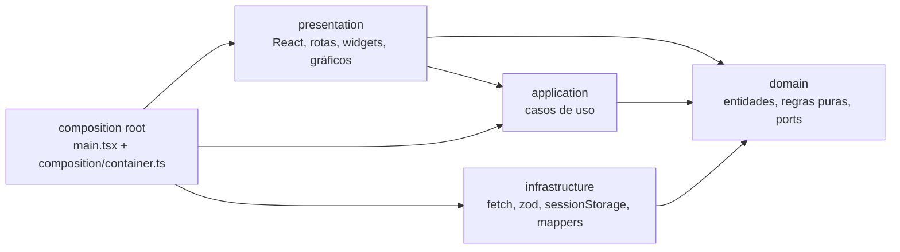

# Arquitetura do dashboard web

Documento de evidência da arquitetura de `web/` (rubrica 37; requisitos ARQ-09, ARQ-14, ARQ-18 e ARQ-19 de `.specs/features/web-dashboard/spec.md`). Cada referência `arquivo:linha` aponta para a declaração citada, com caminho relativo à raiz do repositório. O teste `web/tests/docs/architectureDoc.test.ts` confere que cada referência existe, que as seções obrigatórias estão aqui e que os hashes de refatoração estão no `git log`; uma referência que deixar de valer quebra o CI.

## 1. Visão geral

A web é uma SPA (Vite + React 19 + TypeScript estrito) que fala só com o gateway, direto do navegador, com CORS e `Authorization: Bearer`. O endereço do gateway entra no build por `VITE_API_URL`; todas as rotas ficam sob `/api/v1`, prefixo que o composition root acrescenta uma vez (`web/src/composition/container.ts:31`). Não há proxy da Vercel: o limite de login do gateway é por IP, e um proxy faria todos os usuários dividirem o IP da Vercel.

O composition root é `createContainer` (`web/src/composition/container.ts:64`), chamado uma vez em `web/src/main.tsx:13`. É o único módulo que instancia adaptadores (cliente HTTP, repositórios, armazenamento do token, barramento de sessão) e os entrega aos casos de uso. A apresentação recebe os casos de uso prontos por contexto React; não existe global de onde buscar um adaptador.

As setas são dependências de código: `domain` não conhece ninguém; `application` conhece só `domain`; `infrastructure` implementa os ports de `domain`; `presentation` usa `application` e `domain`, nunca `infrastructure`. O composition root liga tudo.

Features em `web/src/features/`, cada uma com as quatro camadas e um `index.ts` público:

| Feature | O que faz |
| ------- | --------- |
| `auth` | Login, restauração e renovação da sessão, logout, `RequireRole` |
| `registration` | Cadastro do profissional de saúde |
| `dashboard-layout` | Registro de widgets, grade genérica, layout padrão por papel, modo Personalizar (arrastar, mover por teclado, tamanhos, salvar/restaurar) |
| `patient-dashboard` | Resumo do paciente, filtro de período, os 16 widgets do paciente, detalhe do dia |
| `professional` | Carteira de pacientes, resgate de código de convite, regra de risco, visão de um paciente vinculado |
| `admin` | Visão geral e lista de contas do administrador |

`web/src/shared/` guarda o que várias features usam, com as mesmas camadas: `shared/domain` (`AppError`, `Role`, ports comuns como `TokenStore`, `SessionEvents`, `Clock`, `TimeZoneProvider`), `shared/infrastructure` (`FetchHttpClient`, `createRepository`, `parseDto`, `SessionTokenStore`, `SessionEventBus`, `JwtExpiryReader`) e `shared/presentation` (adaptadores de gráfico, tema e tokens, `QueryClient`, componentes de estado). `web/src/app/` tem o roteador e os providers e conta como apresentação.

## 2. Regra de dependência

| De | Pode importar | Não pode importar |
| -- | ------------- | ----------------- |
| `domain` | `domain` da mesma feature e `shared/domain` | qualquer outra camada; qualquer pacote npm ou módulo do Node/DOM |
| `application` | `domain` e `shared/domain` | `infrastructure`, `presentation`, composition root; `react`, `react-dom`, `zod`, `recharts`, `@dnd-kit/*` |
| `infrastructure` | `domain`, `shared/domain`, `shared/infrastructure`, `zod` | `application`, `presentation`, composition root; `react`, `react-dom`, `recharts`, `@dnd-kit/*` |
| `presentation` (inclui `src/app/`) | `application`, `domain`, `shared/*`, `react` e bibliotecas de UI | `infrastructure` |
| `composition/`, `main.tsx` | todas | — (único ponto que liga as camadas) |
| Entre features | só o `index.ts` público da outra feature | arquivo interno de outra feature |
| `recharts` | só `shared/presentation/charts/**` | qualquer outro lugar |
| `@dnd-kit/*` | só `features/dashboard-layout/presentation/**` | qualquer outro lugar |
| Grade do dashboard | — | qualquer widget, o registro ou o catálogo |
| Ciclos | nenhum | qualquer ciclo |

A tabela não é só convenção: `web/.dependency-cruiser.cjs` a transforma em regras que `npm run lint:arch` (`depcruise src`) aplica no CI, e `web/tests/arch/` roda o `dependency-cruiser` sobre árvores de fixture que violam e que respeitam as regras, para provar que elas discriminam. As regras, pelo nome que têm no arquivo:

- `domain-no-npm` (`web/.dependency-cruiser.cjs:30`) e `domain-no-outer-layers` (`web/.dependency-cruiser.cjs:37`)
- `application-no-outer-layers` (`web/.dependency-cruiser.cjs:44`) e `application-no-frameworks` (`web/.dependency-cruiser.cjs:51`)
- `infrastructure-no-outer-layers` (`web/.dependency-cruiser.cjs:58`) e `infrastructure-no-ui-libraries` (`web/.dependency-cruiser.cjs:65`)
- `presentation-no-infrastructure` (`web/.dependency-cruiser.cjs:72`)
- `recharts-only-in-chart-adapters` (`web/.dependency-cruiser.cjs:79`) e `dnd-kit-only-in-layout-editor` (`web/.dependency-cruiser.cjs:86`)
- `grid-knows-no-widgets` (`web/.dependency-cruiser.cjs:93`)
- `feature-public-api-only` (`web/.dependency-cruiser.cjs:100`)
- `no-circular` (`web/.dependency-cruiser.cjs:110`)

## 3. Padrões aplicados

### Repository

- **Onde**: `HttpSummaryRepository` (`web/src/features/patient-dashboard/infrastructure/httpSummaryRepository.ts:17`) implementa o port `SummaryRepository` declarado no domínio (`web/src/features/patient-dashboard/domain/summary.ts:102`). Todos os repositórios HTTP montam a chamada sobre o mesmo auxiliar, `createRepository` (`web/src/shared/infrastructure/http/createRepository.ts:20`).
- **Problema**: o caso de uso precisa de "o resumo do período", não de URL, query string, `tz` e formato do JSON. Sem a abstração, cada tela repetiria o caminho `/dashboard/summary` ou `/professional/patients/:id/summary` e o tratamento do corpo.
- **Princípio**: inversão de dependência e separação de responsabilidades. O domínio define a interface que precisa; a infraestrutura a satisfaz.
- **Alternativa descartada**: chamar `fetch` dentro dos hooks de React (ou um cliente gerado a partir da API) acoplaria a apresentação ao formato do backend e impediria testar o caso de uso com um repositório falso.

### Adapter

- **Onde**: `FetchHttpClient` (`web/src/shared/infrastructure/http/fetchHttpClient.ts:38`) adapta o `fetch` do navegador à forma que os repositórios usam: injeta o token, fala JSON e transforma cada falha (rede, status, corpo de erro) em `AppError`. Do lado dos gráficos, `LineBandChart` (`web/src/shared/presentation/charts/lineBandChart.tsx:91`) adapta o `ComposedChart` do Recharts a uma interface de linhas prontas, faixa e faixa-alvo, sem saber de leituras nem de API; o heatmap é um adaptador em SVG próprio (`web/src/shared/presentation/charts/heatmapChart.tsx:110`).
- **Problema**: `fetch` não rejeita em `4xx/5xx`, não conhece o contrato `{ error, code }` nem o `Retry-After`; o Recharts tem uma API extensa e uma versão maior pode mudá-la. Espalhar qualquer dos dois pelo código faria cada chamador lidar com isso.
- **Princípio**: isolar dependências externas atrás de uma interface própria (proteção contra variação). Trocar a biblioteca de gráficos ou o transporte HTTP toca só o adaptador; a regra `recharts-only-in-chart-adapters` garante isso para os gráficos.
- **Alternativa descartada**: usar `axios` ou o Recharts direto nos widgets. Para o HTTP, um pacote a mais sem ganho sobre `fetch`; para os gráficos, cada widget passaria a depender da API do Recharts.

### Registry + Factory

- **Onde**: `createWidgetRegistry` (`web/src/features/dashboard-layout/presentation/widgetRegistry.ts:40`). `registerWidget` (`web/src/features/dashboard-layout/presentation/widgetRegistry.ts:44`) guarda a definição e é também a Factory: embrulha o carregador em `React.lazy` (`web/src/features/dashboard-layout/presentation/widgetRegistry.ts:46`), de modo que o código do widget e o do gráfico só carregam quando o widget aparece pela primeira vez. O catálogo do paciente é uma linha por widget (`web/src/features/patient-dashboard/presentation/widgetCatalog.ts:25`).
- **Problema**: são 16 widgets de paciente e outros de profissional e admin. Se a grade ou a página conhecessem cada um, todo widget novo editaria a grade, e todo o código de gráficos entraria no bundle inicial (orçamento de 250 kB, DEP-06).
- **Princípio**: aberto/fechado e carregamento sob demanda. A grade conhece células e tamanhos; o registro conhece widgets.
- **Alternativa descartada**: um `switch (id)` na página com imports estáticos. Cada widget novo mexeria nele e o bundle inicial carregaria todos os gráficos.

### Strategy

- **Onde**: `STRATEGIES` (`web/src/features/dashboard-layout/domain/defaultLayout.ts:62`) mapeia cada papel para a função que monta seu layout padrão; `defaultLayoutFor` (`web/src/features/dashboard-layout/domain/defaultLayout.ts:69`) escolhe a estratégia pelo papel (LAY-02).
- **Problema**: quem ainda não salvou um layout precisa ver um painel útil, e o conjunto e a ordem dos widgets mudam por papel.
- **Princípio**: aberto/fechado e responsabilidade única. Cada estratégia é uma função pura; o tipo `Record<Role, ...>` faz o compilador exigir uma estratégia para cada papel novo.
- **Alternativa descartada**: uma cadeia de `if (role === ...)` dentro do caso de uso de layout, ou um layout padrão vindo do servidor. A primeira mistura as três listas em um só lugar; a segunda exigiria uma rota a mais e deixaria o primeiro acesso sem painel quando o servidor falha.

### Observer

- **Onde**: `SessionEventBus` (`web/src/shared/infrastructure/events/sessionEventBus.ts:8`) implementa o port `SessionEvents` (`web/src/shared/domain/ports.ts:17`). O cliente HTTP publica a expiração em um `401` (`web/src/shared/infrastructure/http/fetchHttpClient.ts:75`) e a apresentação assina para voltar ao login.
- **Problema**: várias requisições podem falhar com `401 TOKEN_INVALID` ao mesmo tempo; o usuário deve ser avisado uma vez só (ACC-09), e o cliente HTTP não pode importar a navegação de React.
- **Princípio**: baixo acoplamento. Quem publica não conhece quem escuta.
- **Alternativa descartada**: o cliente HTTP redirecionar sozinho (`window.location`) ou cada hook tratar o `401`. O primeiro acopla infraestrutura à navegação; o segundo repete o tratamento e dispara vários avisos.

### Borda anticorrupção (zod + mapper)

- **Onde**: `parseDto` (`web/src/shared/infrastructure/http/parseDto.ts:10`) valida cada resposta contra o schema zod da feature; o mapper `toSummary` (`web/src/features/patient-dashboard/infrastructure/mappers.ts:5`) copia o DTO validado para o tipo do domínio.
- **Problema**: um contrato quebrado no backend apareceria como `undefined` dentro de um componente, longe da causa.
- **Princípio**: falhar cedo e proteger o modelo do domínio. A mensagem nomeia o endpoint e os caminhos inválidos, nunca os valores, que podem ser dados de saúde.
- **Alternativa descartada**: confiar no tipo TypeScript da resposta (`as SummaryDto`), que não verifica nada em tempo de execução.

## 4. SOLID

### S — Responsabilidade única

`classifyRisk` (`web/src/features/professional/domain/risk.ts:43`) só decide o nível de risco de um paciente a partir das métricas do período. Não busca dados, não formata e não desenha; por isso é testada sem DOM nem rede, e a tabela da carteira só exibe o resultado.

### O — Aberto/fechado

Um widget novo entra por registro, sem editar a grade: `registerWidget` (`web/src/features/dashboard-layout/presentation/widgetRegistry.ts:44`) recebe a definição e o carregador, e `DashboardGrid` (`web/src/features/dashboard-layout/presentation/dashboardGrid.tsx:15`) só conhece células e `data-size`. O teste `openClosed.test.tsx` (`web/src/features/dashboard-layout/presentation/openClosed.test.tsx:35`) registra um widget falso pela API do registro e o vê desenhado na grade, oferecido no editor e salvo, e confere que a grade, o tabuleiro e a página não importam nenhum widget nem mencionam um id.

### L — Substituição de Liskov

O caso de uso `createLoadPatientSummary` (`web/src/features/patient-dashboard/application/loadPatientSummary.ts:30`) depende só do port `SummaryRepository` (`web/src/features/patient-dashboard/domain/summary.ts:102`). Em produção recebe `HttpSummaryRepository` (`web/src/features/patient-dashboard/infrastructure/httpSummaryRepository.ts:17`); nos testes, um repositório em memória (`web/src/features/patient-dashboard/application/loadPatientSummary.test.ts:10`). Os dois cumprem o mesmo contrato (devolvem o resumo ou rejeitam com `AppError`) e o caso de uso se comporta igual com qualquer um.

### I — Segregação de interfaces

Os ports são pequenos e por necessidade. Em `auth`, `SessionRepository` (`web/src/features/auth/domain/ports.ts:12`) tem só `login` e `refresh`, `AccountRepository` (`web/src/features/auth/domain/ports.ts:19`) só `current`, e `TokenExpiryReader` (`web/src/features/auth/domain/ports.ts:25`) só `expiresAt`. Os ports comuns seguem a mesma linha: `TokenStore` (`web/src/shared/domain/ports.ts:6`), `Clock` (`web/src/shared/domain/ports.ts:24`), `TimeZoneProvider` (`web/src/shared/domain/ports.ts:29`). `createRestoreSession` recebe o que lê (conta, token, expiração, relógio) e nunca vê `login`.

### D — Inversão de dependência

O caso de uso declara as dependências como ports em `LoadPatientSummaryDeps` (`web/src/features/patient-dashboard/application/loadPatientSummary.ts:5`), sem importar nenhuma implementação; a regra `application-no-outer-layers` impede que importe. Quem escolhe a implementação é o composition root, que entrega `HttpSummaryRepository` e `BrowserTimeZoneProvider` em `web/src/composition/container.ts:104`.

## 5. Decisões de arquitetura

### ADR-1 — Camadas por feature

#### Contexto

A rubrica pede padrões, princípios de design e arquitetura limpa no frontend. Uma convenção escrita só em documento se perde; o app Flutter já mostrou o valor de uma guarda estrutural (`domain_layering_test.dart`). Ver AD-013 em `.specs/STATE.md`.

#### Decisão

`web/src/features/<feature>/{domain,application,infrastructure,presentation}`, mais `shared/` com as mesmas camadas e um composition root (`web/src/composition/container.ts:64`). A regra de dependência da seção 2 é verificada por `dependency-cruiser` no CI, e features só se enxergam pelo `index.ts` público.

#### Alternativas descartadas

- Camadas globais (`src/domain`, `src/application`, ...): as features ficariam espalhadas, cada PR tocaria quatro pastas e a vizinhança acoplaria features.
- Feature-Sliced Design completo: acrescenta vocabulário (entities, widgets, pages) que dilui as quatro camadas pedidas.

#### Consequência

Cada violação vira erro no CI. O custo é mais pastas e um adaptador por biblioteca externa.

### ADR-2 — Estado de servidor com TanStack Query

#### Contexto

Os widgets do paciente leem todos o mesmo resumo do período; cada um busca seus dados, mas a página não deve fazer uma requisição por widget (PAC-17). O painel recarrega a cada 5 minutos só com a aba visível (PAC-16), e falhas de `503`/`429` merecem nova tentativa com `Retry-After` (ACC-05).

#### Decisão

`@tanstack/react-query` 5.104.1. Um único `QueryClient` (`web/src/shared/presentation/queryClient.ts:35`) com `refetchInterval` de 5 minutos e `refetchIntervalInBackground: false`, nova tentativa só para `unavailable` e `rate-limited`. `useSummary` (`web/src/features/patient-dashboard/presentation/useSummary.ts:25`) usa uma chave por escopo e período, então todos os widgets compartilham uma requisição.

#### Alternativas descartadas

- Redux Toolkit ou Zustand com cache próprio: exigiria escrever deduplicação, recarga e política de nova tentativa à mão.
- Um contexto React que busca o resumo na página: resolve a deduplicação, mas não a recarga com aba visível nem o cache entre trocas de período.

#### Consequência

O estado de servidor fica fora dos componentes e dos casos de uso, que continuam funções puras chamadas pelos hooks. Os widgets carregam e falham de forma isolada sobre a mesma consulta.

### ADR-3 — Biblioteca de gráficos: Recharts com heatmap em SVG próprio

#### Contexto

O catálogo pede linhas com faixa, barras empilhadas, rosca, área de percentis (AGP), dispersão em quadrantes, histograma e heatmap por dia da semana e hora, todos com alternativa textual e tabela (RSP-07).

#### Decisão

Recharts 3.10.1, importado só em `web/src/shared/presentation/charts/` (regra `recharts-only-in-chart-adapters`, `web/.dependency-cruiser.cjs:79`). O Recharts 3 liga `accessibilityLayer` por padrão e tem `AreaChart` com faixa `[min, max]`, `ReferenceArea` e `Scatter`; não tem heatmap, então o heatmap é SVG próprio (`web/src/shared/presentation/charts/heatmapChart.tsx:110`). Os peers `react ^19`, `react-dom ^19` e `react-is ^19` são atendidos pelo React 19.3.0.

#### Alternativas descartadas

- Chart.js: desenha em `<canvas>`, sem árvore acessível por elemento.
- ECharts ou Nivo: mais pesados para o orçamento de 250 kB do carregamento inicial.
- D3 direto: flexível, mas cada gráfico seria escrito do zero.

#### Consequência

Os widgets dependem dos adaptadores, não do Recharts. Uma troca de biblioteca toca só `shared/presentation/charts/`. Os gráficos carregam com o widget, por `React.lazy`, fora do bundle inicial.

### ADR-4 — Estilos e tema: CSS Modules com tokens

#### Contexto

O painel precisa de tema claro, escuro e do sistema (RSP-10) e de contraste verificável (texto 4,5:1, partes gráficas 3:1), sem pesar no bundle.

#### Decisão

CSS Modules por componente e propriedades CSS (tokens) em `web/src/shared/presentation/theme/tokens.css:8`; o bloco escuro (`web/src/shared/presentation/theme/tokens.css:70`) só sobrescreve cores. `ThemeProvider` (`web/src/shared/presentation/theme/themeProvider.tsx:57`) põe `data-theme` no `<html>` e guarda a preferência no `localStorage`, com `try/catch`. `tokens.test.ts` lê o CSS e confere o contraste de cada par nos dois temas.

#### Alternativas descartadas

- CSS-in-JS com runtime (styled-components, Emotion): custo de execução e de bundle.
- Tailwind: tema por classes utilitárias e mais uma etapa de build, sem ganho sobre tokens CSS.

#### Consequência

Sem runtime de estilos, o tema muda por um atributo e cada token tem o contraste testado. Os componentes de gráfico leem as cores dos mesmos tokens.

### ADR-5 — Armazenamento do token em `sessionStorage`

#### Contexto

A SPA fala direto com o gateway, sem BFF, então não há cookie `httpOnly` emitido para a origem da web. O token precisa sobreviver a um reload e não deve vazar por URL, cookie legível ou armazenamento que dura além da aba (ACC-12).

#### Decisão

`SessionTokenStore` (`web/src/shared/infrastructure/storage/sessionTokenStore.ts:41`) guarda o token só em `sessionStorage`. Quando o navegador recusa o `sessionStorage`, o token fica em memória e `persistent` passa a `false`, para a interface avisar que um reload desconecta. O papel vem sempre do `/me`; o `exp` do JWT só agenda a renovação.

#### Alternativas descartadas

- `localStorage`: sobrevive ao fechamento da aba e é compartilhado entre abas.
- Cookie legível por script: mesmo risco de XSS, mais exposição em cada requisição.
- Cookie `httpOnly`: exigiria um BFF ou mudanças de domínio e CSRF no gateway, fora do escopo.

#### Consequência

O token morre com a aba e sobrevive ao reload. Um XSS ainda poderia lê-lo; a mitigação é a CSP restritiva do `vercel.json` e a validação de entrada, não o armazenamento.

### ADR-6 — Arrastar e soltar com `@dnd-kit`, carregado sob demanda

#### Contexto

O modo Personalizar reordena widgets arrastando (LAY-03) e também pelo teclado (LAY-05). No design, o suporte do `@dnd-kit` ao React 19 não estava confirmado.

#### Decisão

`@dnd-kit/core` 6.3.1 e `@dnd-kit/sortable` 10.0.0, cujos peers aceitam React 19; o spike `sortable.smoke.test.tsx` reordena com o sensor de teclado. A biblioteca só aparece em `features/dashboard-layout/presentation/` (regra `dnd-kit-only-in-layout-editor`, `web/.dependency-cruiser.cjs:86`), na prática em `web/src/features/dashboard-layout/presentation/sortableGrid.tsx:90`. O editor é um chunk separado, carregado com `React.lazy` no primeiro clique em "Personalizar" (`web/src/features/dashboard-layout/presentation/layoutBoard.tsx:9`). Botões de mover garantem o teclado mesmo sem arrastar.

#### Alternativas descartadas

- Pragmatic Drag and Drop: era o plano B caso o spike falhasse; não foi necessário.
- `react-grid-layout`: traz um modelo de grade próprio que competiria com a grade de 1/2/4 colunas.
- `react-beautiful-dnd`: descontinuado.

#### Consequência

Quem só lê o painel nunca baixa a biblioteca de arrastar. Trocar de biblioteca toca um componente.

## 6. Refatorações

Duas refatorações foram feitas em commits `refactor:` separados, com a suíte verde antes e depois e nenhum teste existente editado. Nos dois casos o `jscpd` já estava em 0 % na configuração do gate (`npm run dup`, limite de 3 %), então a duplicação medida não tinha como cair; o motivo foi repetição semântica que a ferramenta não enxerga.

### `b9041b2` — `refactor(web): extract the HTTP repository helper`

- **Motivo**: os repositórios HTTP repetiam a sequência `http.request` seguida de `parseDto(schema, payload, "MÉTODO caminho")`, cada um redigitando o rótulo do endpoint. O `jscpd` não acusava nada porque as cópias diferem no schema, no caminho e no mapper. Um rótulo escrito à mão podia levar a query string, e com ela um id de paciente, para a mensagem de erro.
- **O que mudou**: nasceu `createRepository` (`web/src/shared/infrastructure/http/createRepository.ts:20`), com `fetchDto` (que deriva o rótulo do método e do caminho, sem a query string) e `send` (para respostas que ninguém lê, como `DELETE`). Os repositórios de sessão, conta, layout, resumo e diário passaram a usá-lo; o de resumo ainda passa o próprio rótulo para o caminho do profissional. A mensagem do commit fala em dez chamadas `parseDto` substituídas; a contagem real no diff é de 9 chamadas `parseDto` mais 1 `http.request` sem leitura que virou `send`, dez pontos de chamada no total.
- **Testes**: antes 1232 testes verdes; depois 1238 (os 6 novos são `createRepository.test.ts`). `jscpd` no gate: 0 clones, 0,00 % antes e depois.

### `b1b56df` — `refactor(web): extract the summary widget factory`

- **Motivo**: catorze widgets do paciente (cinco KPIs, a tabela de excursões e oito gráficos) escreviam à mão o mesmo componente: receber `size` da grade, repassá-lo com o título a `SummaryWidget` ou `ChartWidget` e encadear `isEmpty` e `emptyCause`.
- **O que mudou**: `defineSummaryWidget` (`web/src/features/patient-dashboard/presentation/widgets/defineSummaryWidget.tsx:37`) e `defineChartWidget` (`web/src/features/patient-dashboard/presentation/widgets/defineSummaryWidget.tsx:48`) montam o componente; cada widget declara só o que é seu (título, teste de vazio, causa, figura e alternativa). Nos gráficos, `isEmpty: hasNoReadings` virou o padrão. `cardFreshness` e `chartDayDetail` mantêm componente próprio porque precisam de um hook antes do cartão ou leem o diário.
- **Testes**: antes 1238 testes verdes; depois 1245 (os 7 novos são `defineSummaryWidget.test.tsx`). `jscpd` no gate: 0 clones, 0,00 % antes e depois.

## 7. Limites conhecidos

Desvios marcados com `SPEC_DEVIATION` no código da web:

- `createLoadDayDetail` recebe os ports em um objeto de dependências e devolve os dias carregados, em vez da assinatura `createLoadDayDetail(day, tz)` que a tarefa nomeava: o widget troca de dia sem nova requisição, então o dia não é argumento da carga (`web/src/features/patient-dashboard/application/loadDayDetail.ts:59`).
- `defineSummaryWidget` mora em `features/patient-dashboard/presentation/widgets` e não em `shared/presentation/widgets`, porque monta o `useWidgetSummary` da feature e o `WidgetShell` de `dashboard-layout`, e um módulo de `shared` não pode importar uma feature (`web/src/features/patient-dashboard/presentation/widgets/defineSummaryWidget.tsx:7`).
- A regra de risco usa `veryLow + low` como aproximação do tempo abaixo de 70 mg/dL, porque o resumo informa as zonas relativas ao limite baixo do próprio paciente, não a um 70 fixo (`web/src/features/professional/domain/risk.ts:49`).

Pendências:

- Não há endpoint de diário para o profissional ler um paciente vinculado (`/readings`, `/carbs` e `/insulin` só respondem pela pessoa logada). Por isso `chart-day-detail` fica fora da visão do paciente vinculado (`web/src/features/professional/presentation/patientDetailPage.tsx:26`).
- O resumo ainda não traz os limites do paciente, então a faixa-alvo do gráfico de tendência usa o padrão do backend, 80 a 180 mg/dL (`web/src/features/patient-dashboard/presentation/widgets/trendModel.ts:12`), até o resumo expô-los.
- A pontuação de acessibilidade do Lighthouse (RSP-11, meta ≥ 90 no login e no dashboard do paciente) está configurada em `web/lighthouserc.json`, mas é medida na fase de validação, com a pilha completa no ar; no CI a acessibilidade é coberta por `vitest-axe`.
